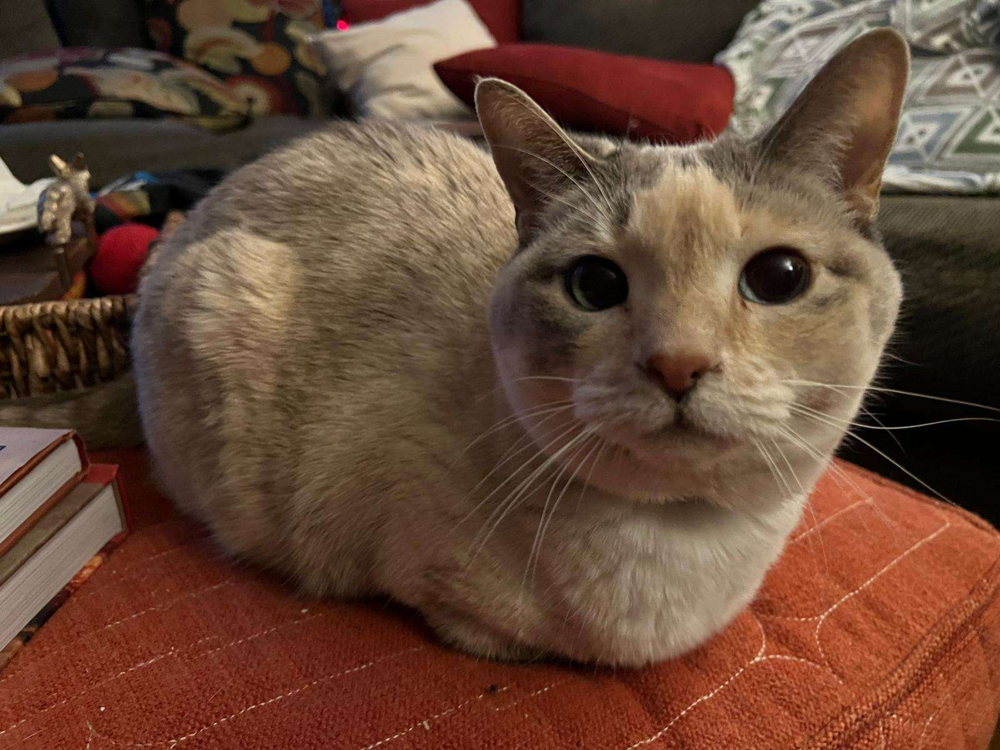

# Toastvim

Welcome to **Toastvim** – Where your code gets *Toast*, just like *Toast*!!!!!!



## ✨ Features

- **Toast**: TOAST!!!!
- **Template**: File template support using expressions to auto fill information

## ⚡️ Requirements

<details>
<summary>Dependences</summary>

- lazy.nvim
- lua
- lua51
- luarocks
- git
- lazygit
- fd
- ripgrep
- fzf
- nodejs
- npm
- curl
- tree-sitter-cli
- tectonic
- ghostscript


</details>

## 📦 Installation

<details><summary>Lazy.nvim</summary>

```lua
return {
  "DanteDogDev/ToastVim",
  import = "toastvim.plugins",

  ---@type ToastVim.Config
  opts = {},
}
```

</details>

## ⚙️ Configuration

<details><summary>opts</summary>

```lua
-- Good Example

---@type ToastVim.Config
opts = {
    -- Gets piped into conform.nvim
    formatters_by_ft = {
        lua = { "stylua" },
    },
    -- Gets piped into nvim-lint
    linters_by_ft = {
    },
    lsp = {
        keymaps = {
            { mode = "n", keys = "<leader>ch", action = "<CMD>LspClangdSwitchSourceHeader<CR>", opts = {desc = "Switch to Source Header"}, ft = {"cpp","c"}},
        },
    },
    template = {
        expressions = {
            ["${FILENAME}"] = function() return vim.fn.expand("%:t:r") end,
            ["${DATE}"] = function() return os.date("%d/%m/%y") end,
            ["${AUTHOR}"] = function() return vim.fn.system("git config user.name"):gsub("\n", "") end,
            ["${EMAIL}"] = function() return vim.fn.system("git config user.email"):gsub("\n", "") end,
            ["${PROJECT}"] = function() return vim.fn.system('powershell -Command "Split-Path -Leaf (Get-Location)"'):gsub("\n", "") end,
        },
    },
},
```

</details>
